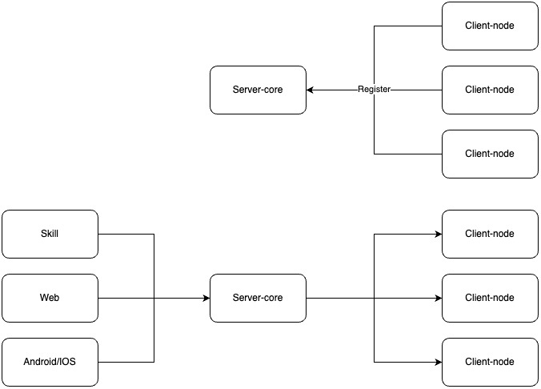

# Удалённое управление компьютером через Яндекс Алису

## Описание проекта
Проект представляет собой систему для удалённого управления компьютерами через голосовые команды Яндекс Алисы.

## Архитектура
Система состоит из трёх компонентов:
1. Клиентские ноды - приложения, работающие на управляемых компьютерах
2. Серверная нода - центральный сервер для управления клиентами
3. Навык Яндекс Алисы - голосовой интерфейс для пользователя

  

## Материалы
- [Хабр]()

## Лицензия
Copyright © 2025 [Danila Belyakov](https://github.com/danbeldev) \
Этот проект использует [MIT](https://github.com/danbeldev/remote-ops/blob/master/LICENSE) лицензию